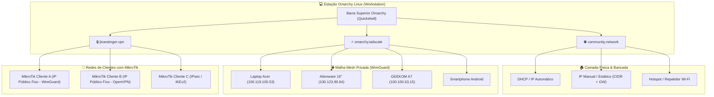

# 🌐 Guia Passo a Passo: Rede, Tailscale e VPN para Clientes MikroTik

> **Classificação de Privacidade:** 🟢 **PÚBLICO (`privacy: public`)**  
> **Objetivo:** Manual de referência operacional para administração de estações de trabalho Omarchy Linux, controle de IP fixo/DHCP na bancada, malha privada Tailscale e conexões com roteadores MikroTik de clientes.

---

## 🏛️ 1. Visão Geral da Arquitetura de Rede

A barra de status e o subsistema de rede do Omarchy foram configurados com um trio modular de ferramentas consagradas de mercado, garantindo separação clara de responsabilidades:



---

## 🛠️ 2. Gerenciador de Rede Física: `community.network`

O plugin padrão básico foi substituído pelo **`community.network`** (*Network Manager with Wi-Fi Repeater & Hotspot*), instalado em `~/.config/omarchy/plugins/community.network`.

### 🎯 Como alternar entre IP Automático (DHCP) e IP Manual (Estático):
1. Clique no ícone de rede na barra superior para abrir o painel de controle.
2. Na seção da interface ativa (ex.: Ethernet `enp2s0` ou Wi-Fi `wlan0`), selecione a conexão:
   - **Modo DHCP (Automático):** Clique em `<Automatic>` e em **Apply**. A interface requisitará IP via broadcast DHCP.
   - **Modo Manual (Estático):** 
     1. Alterne para `<Manual>`.
     2. Preencha o **Endereço CIDR** (ex.: `192.168.88.50/24`).
     3. Preencha o **Gateway** (ex.: `192.168.88.1`).
     4. Preencha o **DNS** (ex.: `1.1.1.1, 8.8.8.8`).
     5. Clique em **Apply** para aplicar imediatamente sem reiniciar o NetworkManager.
3. **Atalho Rápido (TUI):** Com o painel aberto, pressione <kbd>N</kbd> no teclado para disparar o `nmtui` em janela flutuante caso prefira navegação puramente via terminal.

### 📡 Hotspot e Repetidor Wi-Fi:
* Pelo mesmo painel, você pode ativar o **Wi-Fi Repeater** (recebe internet via Wi-Fi e retransmite em outra frequência) ou **Hotspot** dedicado.
* Ao ativar, o painel exibe um modal centralizado com **QR Code** para leitura instantânea por smartphones e dispositivos móveis.

---

## ⚡ 3. Malha Privada Tailscale: `omarchy.tailscale`

O Tailscale garante interconexão segura entre os nós da bancada e dispositivos móveis sem abrir portas no roteador de borda.

### ⚙️ Componentes Configurados:
* **Daemon do Sistema:** `tailscaled.service` habilitado e ativo via `systemd`.
* **Permissão de Operador Não-Root:** Concedido com `sudo tailscale set --operator=brn` em todas as máquinas. Isso permite que a interface gráfica execute comandos sem solicitar senha de root repetidamente.
* **Barra de Tarefas:** Plugin nativo de primeira classe `omarchy.tailscale` habilitado na seção direita da barra.

### 📋 Mapeamento de IPs na Tailnet:
| Nó / Dispositivo | Hostname | IP Tailscale (IPv4) | Função |
|---|---|---|---|
| **ACER Aspire** | `acer-brn` | `100.119.100.53` | Estação Portátil |
| **Alienware 16"** | `alienware-brn` | `100.123.90.64` | Estação Principal |
| **GEEKOM A7 MAX** | `geekom-brn` | `100.100.63.15` | Mini Servidor |
| **Smartphone** | `s25-ultra-de-bruno` | `100.114.183.65` | Acesso Móvel |

---

## 🔒 4. Conexão a Redes de Clientes com MikroTik: `jkoestinger.vpn`

Para acessar a infraestrutura de clientes com IP público fixo e roteadores MikroTik RouterOS v7, utilizamos o plugin **`jkoestinger.vpn`**, que se comunica diretamente com os backends do **NetworkManager**.

### 🔌 Cenário 1: Cliente com WireGuard no MikroTik (Recomendado no RouterOS v7)
O WireGuard é o protocolo de maior rendimento e menor overhead no RouterOS v7.

1. **No MikroTik do Cliente:**
   - Crie a interface WireGuard (`/interface wireguard add name=wg-remoto listen-port=13231`).
   - Crie o peer apontando para a chave pública da sua máquina (`/interface wireguard peers add interface=wg-remoto public-key="..." allowed-address=10.200.0.2/32`).
2. **Na sua Workstation Omarchy:**
   - Salve o arquivo de configuração `cliente-alpha.conf` contendo a chave privada, endpoint (IP público fixo do cliente) e rotas permitidas.
   - Importe no NetworkManager:
     ```bash
     nmcli connection import type wireguard file cliente-alpha.conf
     ```
3. **Pela Interface da Barra:**
   - O widget de VPN na barra reconhecerá o perfil `cliente-alpha` automaticamente.
   - Basta clicar no chip para conectar. O tráfego para a sub-rede do cliente passará pelo túnel imediatamente.

---

### 🛡️ Cenário 2: Cliente com OpenVPN no MikroTik
Caso o cliente utilize servidor OpenVPN no MikroTik:

1. **Importação do Perfil `.ovpn`:**
   ```bash
   nmcli connection import type openvpn file cliente-beta.ovpn
   ```
2. **Armazenamento Seguro de Credenciais (Opcional - Conexão em 1 Clique):**
   Para não precisar digitar senha a cada conexão:
   ```bash
   nmcli connection modify cliente-beta +vpn.data username=bruno.admin
   nmcli connection modify cliente-beta +vpn.data password-flags=0
   nmcli connection modify cliente-beta vpn.secrets 'password=SuaSenhaForte'
   ```
3. Ao clicar no perfil no painel de VPN, a conexão subirá em 1 segundo.

---

## 🚀 5. Replicação nos 3 Equipamentos (Runbook de Comandos)

Caso precise reconfigurar ou auditar os nós da bancada:

```bash
# 1. Instalação e Ativação do community.network
omarchy plugin enable community.network --section right
omarchy plugin disable omarchy.network

# 2. Instalação e Ativação do jkoestinger.vpn
omarchy plugin enable jkoestinger.vpn --section right

# 3. Tailscale Status & Operator
tailscale status
sudo tailscale set --operator=brn
```
